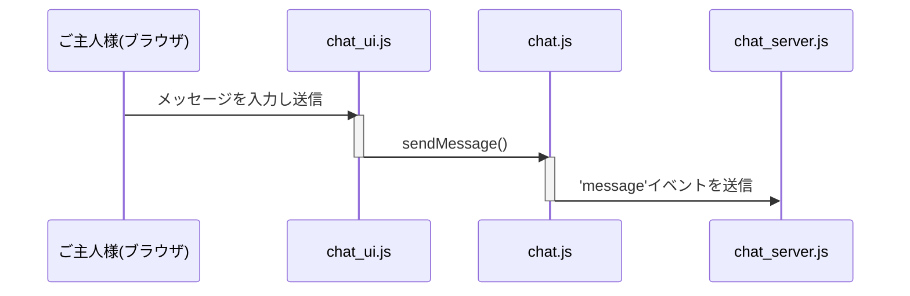

```mermaid
sequenceDiagram
    participant ご主人様 as ご主人様(ブラウザ)
    participant ui as chat_ui.js
    participant chat as chat.js
    participant server as chat_server.js

    ご主人様->>ui: メッセージを入力し送信
    activate ui
    ui->>chat: sendMessage()
    deactivate ui

    activate chat
    chat->>server: 'message'イベントを送信
    deactivate chat
```
